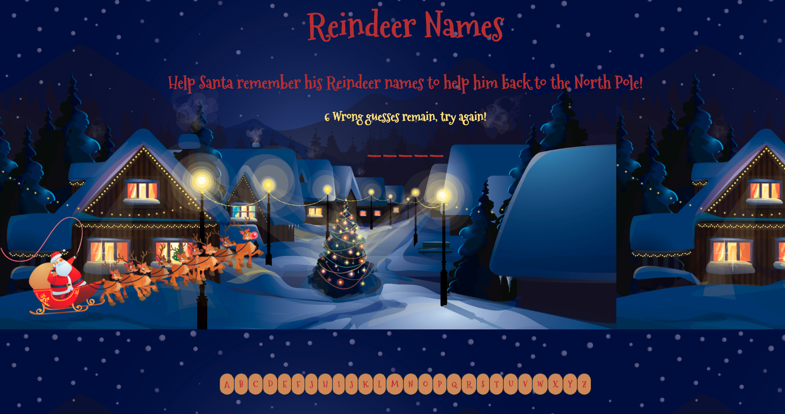
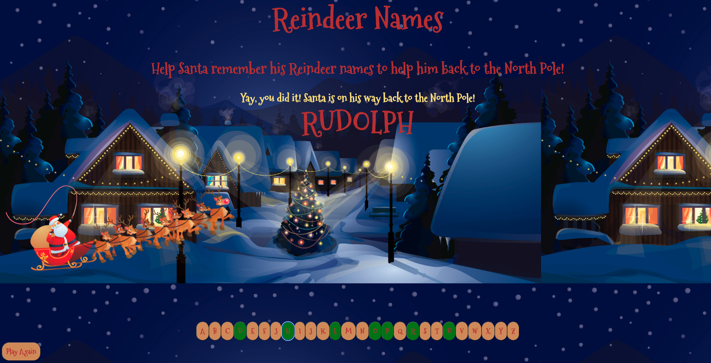
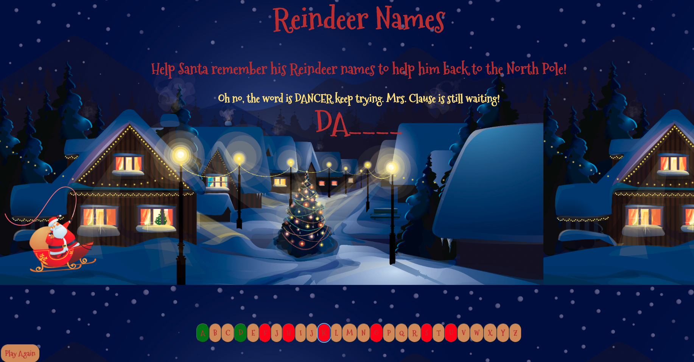

# Reindeer Names

## How to Play
Like Spaceman, Reinder Names gives the opportunity for the player to help guess a word.  In this game the secret word would be one of Santa's Reindeer names which are either DASHER, DANCER, PRANCER, VIXEN, COMET, CUPID, DONNER, BLITZEN, or RUDOLPH. 

When the player guesses the correct Reindeer name within the 6 guesses, the player wins! 

Each time the player guesses a wrong letter of the secret word, one of the Reindeer disappear.  The player gets 6 chances before all the Reindeer disappear and loses the game.  

## Technologies Used

- JavaScript
- HTML
- CSS

## Getting Started

https://cathygarciapinon.github.io/Spaceman/

## Next Steps

- Add audio
- Add falling snow gif